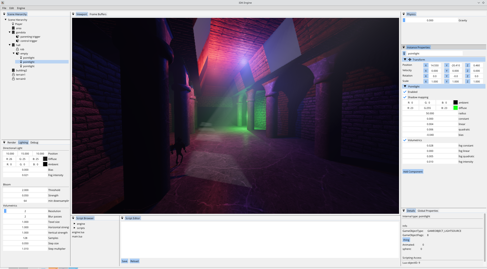
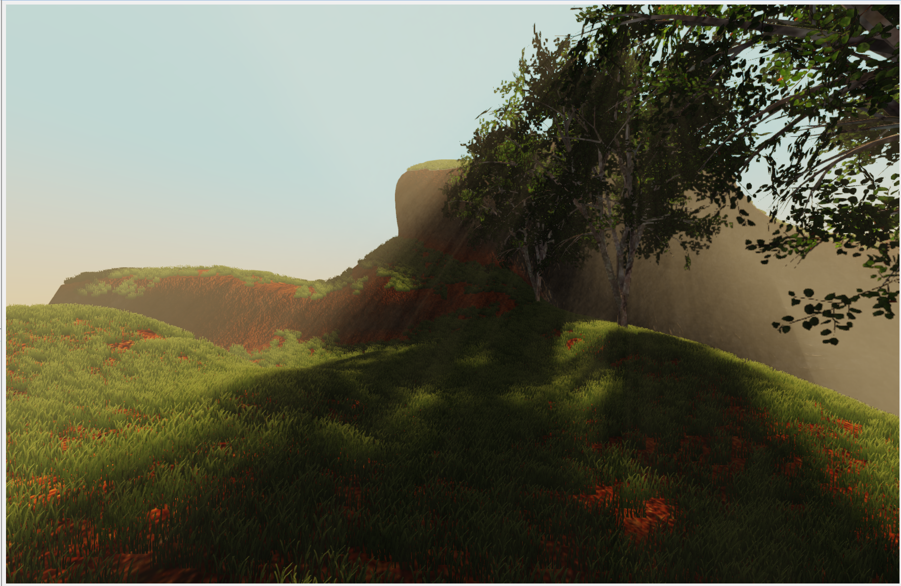

# IDK Engine

### This repo has been abandoned
IDK Engine is being rewritten from scratch, the new repo can be found [here](https://github.com/mellic03/IDKGameEngine)

### About the abandonment
I started this project with no C++ or OpenGL experience, but I had experience with C and writing a [software rasterizer](https://github.com/mellic03/software-renderer). The purpose of this project was to learn C++ and OpenGL, so naturally this resulted in a *terrible* codebase.

This was a great learning exercise and it taught me a lot about the common pitfalls to avoid when writing both a large C++ project and a 3D rendering engine.

### Gallery

